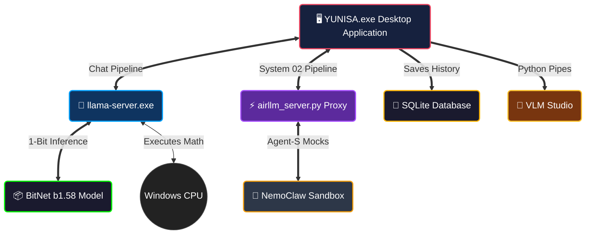

<div align="center">


# Ｙ Ｕ Ｎ Ｉ Ｓ Ａ

_Your Intelligence. Your Machine. Your Rules._

<br>

[](https://github.com/Mavioni/Yunisa/releases/latest)
[](LICENSE)
[](https://github.com/Mavioni/Yunisa/releases/latest)

<br>

> **YUNISA** runs a powerful AI chatbot entirely on your computer — no cloud, no API keys, no telemetry, and no data ever leaving your machine. 
> Powered by the breakthrough 1-bit LLM technology of Microsoft's **BitNet.cpp**.

</div>

<br>

---

<div align="center">
  <h2>✦ The Experience ✦</h2>
</div>

<table align="center" width="100%">
  <tr>
    <td width="50%">
      <h3>🔒 Absolute Privacy</h3>
      <p>Your conversations <b>never leave your computer</b>. There is no server, no telemetry, no cloud integration. Every thought, every word, and every prompt stays securely on your local SSD.</p>
    </td>
    <td width="50%">
      <h3>⚡ Pure Efficiency</h3>
      <p>No GPU required. YUNISA leverages <a href="https://huggingface.co/microsoft/BitNet-b1.58-2B-4T">BitNet b1.58</a>—a 2.4 billion parameter model utilizing 1.58-bit ternary quantization. It blazes through inference on any modern x86 CPU.</p>
    </td>
  </tr>
  <tr>
    <td width="50%">
      <h3>💎 Elegant Design</h3>
      <p>A beautifully sleek, cinematic dark-themed UI that feels like an extension of your operating system. Seamlessly integrated with Windows, it sits quietly in your system tray until summoned.</p>
    </td>
    <td width="50%">
      <h3>🧠 Untethered Intelligence</h3>
      <p>Once you download the initial model, YUNISA doesn't require an active internet connection. Take your creative partner with you on a flight, to a cabin, or entirely off the grid.</p>
    </td>
  </tr>
</table>

<br>

---

<div align="center">
  <h2>New Architecture & Subsystems</h2>
</div>

### 🐾 Native Autonomous Agent-S
YUNISA now integrates a dual-engine architecture capable of running **Agent-S (AirLLM 70B)** workflows directly inside the primary Chat interface. Simply toggle "Agent Mode" to securely detach from the BitNet runtime and unleash autonomous PC interactions natively mapped into your local database.

### 🌓 Obsidian Glass & Luminous Themes
A comprehensively upgraded UI/UX pipeline rendering ultra-premium **Glassmorphism**. Seamlessly swap between the dark *Obsidian Glass* layout or the sleek *Luminous* light mode directly through the intuitive Hardware Telemetry settings.

### 🔬 VLM Research Studio & DTIA Pipeline
Leverage the newly implemented **Dialectical Ternary Inference Architecture (DTIA)** hardware constraint pipelines and the bleeding-edge **VLM Research Studio** for native python model fine-tuning loops right from the frontend interface.

<br>

---

<div align="center">
  <h2>Ignition Sequence</h2>
</div>

### 1. 📥 Download
Acquire the latest build directly from our [Releases Page](https://github.com/Mavioni/Yunisa/releases/latest). Look for **`YUNISA Setup 1.0.0.exe`**.

### 2. ⚡ Install
Launch the setup. YUNISA gracefully installs itself into your local environment — zero administration privileges required.

### 3. 🧠 Initialize the Core
On your first launch, YUNISA will seamlessly download the hyper-optimized 1-bit AI model (~1.2 GB) directly to your machine. 

### 4. 💬 Interface
That’s it. Start exploring. No accounts. No tracking. Pure local intelligence.

<br>

---

<div align="center">
  <h2>Architecture Diagram</h2>
  <p><i>The inner workings of a private intellect.</i></p>
</div>



<br>

---

<div align="center">
  <h2>Technological Core</h2>
</div>

| Component | Technology | Purpose |
|:---|:---|:---|
| **Shell** | [Electron](https://www.electronjs.org/) | Seamless Desktop Integration |
| **Engine** | [BitNet.cpp](https://github.com/microsoft/BitNet) / [llama.cpp](https://github.com/ggerganov/llama.cpp) | Ultra-fast 1-Bit Inference |
| **Model** | [BitNet b1.58-2B-4T](https://huggingface.co/microsoft/BitNet-b1.58-2B-4T) | 2.4 Billion Parameters on CPU |
| **Memex** | [SQLite](https://sqlite.org/) | Perpetual Local Memory |
| **Frontend** | HTML / CSS / JS | Minimalist Vanilla Interface |

<br>

---

<div align="center">
  <h2>Frequently Asked Questions</h2>
</div>

<details>
<summary><b>Is my data truly private?</b></summary>
<br>
Yes. YUNISA runs 100% locally. There is no server component, no analytics, no telemetry. Your conversations are stored securely in a SQLite database on your machine at <code>%APPDATA%/yunisa/conversations.db</code>. If you delete the file, they are gone forever.
</details>

<details>
<summary><b>How fast is the inference?</b></summary>
<br>
On a modern x86 CPU, expect 5-7 tokens per second. That equates to roughly 1-2 sentences per second — fast enough for a natural, flowing conversation. By utilizing BitNet's 1-bit quantization, energy consumption is reduced by 70-80% compared to standard AI models.
</details>

<details>
<summary><b>Can I operate entirely offline?</b></summary>
<br>
Yes. After the one-time initial model download, no internet connection is required. All AI inference is local.
</details>

<details>
<summary><b>Where is my local memory stored?</b></summary>
<br>
All persistent YUNISA data lives quietly in <code>%APPDATA%/yunisa/</code>:<br>
• <code>conversations.db</code> — Your encrypted chat history<br>
• <code>config.json</code> — Your system preferences<br>
• <code>models/</code> — Your downloaded neural networks
</details>

<br>

---

<div align="center">
  <h2>Building from Source</h2>
</div>

For the engineers and architects looking to modify the core:

```bash
# Clone the repository
git clone https://github.com/Mavioni/Yunisa.git
cd Yunisa

# Install dependencies
npm install
pip install -r python/requirements.txt

# Ignite Development Mode
npm run start
```

> **Note:** The `resources/binaries/` directory must contain `llama-server.exe` and its dynamically linked libraries (`ggml.dll`, `llama.dll`, `llava_shared.dll`) previously compiled from the [BitNet.cpp](https://github.com/microsoft/BitNet) source.

<br>

---

<div align="center">
  <i>"A machine that thinks, tucked away in the shadows of your hard drive."</i>
  
  <br><br><br>
  
  
  <br>
  <p>Released under the MIT License.</p>
</div>
