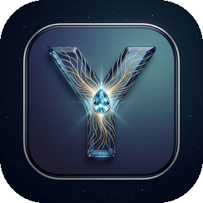

<div align="center">



# YUNISA

### Your Local AI. Private. Offline. Yours.

YUNISA runs a powerful AI chatbot **entirely on your computer** — no cloud, no API keys, no data ever leaving your machine. Powered by [BitNet.cpp](https://github.com/microsoft/BitNet) and Microsoft's 1-bit LLM technology.

[](https://github.com/Mavioni/Yunisa/releases/latest)
[](LICENSE)
[](https://github.com/Mavioni/Yunisa/releases/latest)

---

**[Download for Windows](#-quick-start)** | **[Features](#-features)** | **[How It Works](#-how-it-works)** | **[FAQ](#-faq)**

</div>

---

## Quick Start

### 1. Download

Go to the [**Latest Release**](https://github.com/Mavioni/Yunisa/releases/latest) and download **`YUNISA Setup 1.0.0.exe`**.

### 2. Install

Run the installer. YUNISA installs to your local Programs folder — no admin required.

### 3. Download the AI Model

On first launch, YUNISA will walk you through downloading the AI model (~1.2 GB). This is a one-time download.

### 4. Start Chatting

That's it. Your private AI assistant is ready. No accounts. No sign-ups. No internet required after setup.

---

## Features

### Private by Design
Your conversations **never leave your computer**. There is no server, no telemetry, no cloud. Every word stays on your machine.

### Runs on CPU
No GPU required. YUNISA uses Microsoft's [BitNet b1.58](https://huggingface.co/microsoft/BitNet-b1.58-2B-4T) — a 2.4 billion parameter model optimized for CPU inference with 1-bit quantization. It runs efficiently on any modern x86 processor.

### Full Chat Experience
- Streaming responses in real-time
- Markdown rendering with code blocks
- Conversation history saved locally
- Multiple conversations with sidebar navigation
- Dark theme UI

### Model Management
- Download models from Hugging Face with progress tracking
- Switch between installed models
- Delete models to free disk space

### Desktop Integration
- System tray — minimize to tray, always accessible
- Auto-updates from GitHub Releases
- Native Windows installer with Start Menu shortcut

---

## How It Works

```
YUNISA.exe
  |
  +-- Electron Shell (native window + system tray)
  |
  +-- llama-server.exe (BitNet.cpp inference engine)
  |     Runs locally on 127.0.0.1:8080
  |     OpenAI-compatible chat API
  |
  +-- SQLite Database
  |     Conversations stored in %APPDATA%/yunisa/
  |
  +-- AI Model (downloaded on first run)
        BitNet b1.58-2B-4T (1.2 GB GGUF)
        2.4B parameters, 1-bit quantization
```

YUNISA is an Electron desktop app that manages a local [llama.cpp](https://github.com/ggerganov/llama.cpp)-based inference server. When you send a message, it goes to `localhost` — never to the internet. The server runs the BitNet model on your CPU and streams the response back.

---

## System Requirements

| Requirement | Minimum |
|-------------|---------|
| **OS** | Windows 10/11 (64-bit) |
| **CPU** | Any modern x86-64 processor |
| **RAM** | 4 GB |
| **Disk** | ~1.5 GB (app + model) |
| **GPU** | Not required |
| **Internet** | Only for initial model download |

---

## FAQ

<details>
<summary><b>Is my data private?</b></summary>

Yes. YUNISA runs 100% locally. There is no server component, no analytics, no telemetry. Your conversations are stored in a SQLite database on your machine at `%APPDATA%/yunisa/conversations.db`. Delete the file and they're gone.
</details>

<details>
<summary><b>How fast is it?</b></summary>

On a modern x86 CPU, expect 5-7 tokens per second. That's roughly 1-2 sentences per second — fast enough for a natural conversation. BitNet's 1-bit quantization reduces energy consumption by 70-80% compared to standard models.
</details>

<details>
<summary><b>Can I use it offline?</b></summary>

Yes, after the initial model download. YUNISA checks for app updates on launch (requires internet), but this is optional and non-blocking. All AI inference is local.
</details>

<details>
<summary><b>What model does it use?</b></summary>

[BitNet b1.58-2B-4T](https://huggingface.co/microsoft/BitNet-b1.58-2B-4T) by Microsoft — a 2.4 billion parameter language model using ternary (1.58-bit) quantization. It's specifically designed for efficient CPU inference.
</details>

<details>
<summary><b>Can I add other models?</b></summary>

The model registry is currently hardcoded to BitNet-compatible GGUF models. Support for additional models will be added in future releases.
</details>

<details>
<summary><b>Where is my data stored?</b></summary>

All YUNISA data lives in `%APPDATA%/yunisa/`:
- `conversations.db` — your chat history (SQLite)
- `config.json` — settings
- `models/` — downloaded AI models
</details>

<details>
<summary><b>How do I uninstall?</b></summary>

Use Windows "Add or Remove Programs" or run the uninstaller from the Start Menu. To also remove your data, delete `%APPDATA%/yunisa/`.
</details>

---

## Tech Stack

| Component | Technology |
|-----------|-----------|
| Desktop Shell | [Electron](https://www.electronjs.org/) |
| AI Engine | [BitNet.cpp](https://github.com/microsoft/BitNet) / [llama.cpp](https://github.com/ggerganov/llama.cpp) |
| AI Model | [BitNet b1.58-2B-4T](https://huggingface.co/microsoft/BitNet-b1.58-2B-4T) (GGUF) |
| Database | [SQLite](https://sqlite.org/) via better-sqlite3 |
| Frontend | HTML / CSS / JavaScript |
| Installer | NSIS via electron-builder |
| Auto-Update | electron-updater + GitHub Releases |

---

## Building from Source

```bash
git clone https://github.com/Mavioni/Yunisa.git
cd Yunisa
npm install
npm run start        # Run in development mode
npm run dist         # Build installer
```

Requires: Node.js 20+, npm, Windows 10/11.

The `resources/binaries/` directory must contain `llama-server.exe` and its DLLs (`ggml.dll`, `llama.dll`, `llava_shared.dll`) compiled from [BitNet.cpp](https://github.com/microsoft/BitNet).

---

## License

MIT

---

<div align="center">

**Built with [BitNet.cpp](https://github.com/microsoft/BitNet) by Microsoft**

*Your intelligence. Your machine. Your rules.*

</div>
