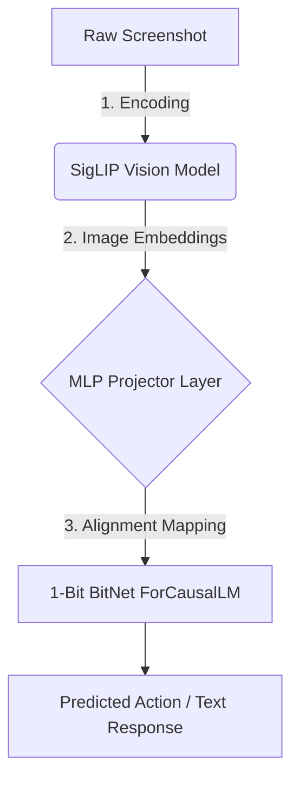

# How to Train YunisaVLM: A Complete Visual Guide

Welcome to the definitive guide for training your custom 1-bit Vision-Language Model. This interactive artifact will walk you through the monumental process of bridging an image encoder to Microsoft's BitNet.

````carousel
## Phase 1: Hardware & Dataset Preparation
To begin the monumental effort of training YunisaVLM, we must acquire the necessary computing power and the structured dataset. A standard CPU will not suffice; you need massive parallel calculation capabilities.


_Massive 8x Nvidia H100 Cloud Cluster_

> [!CAUTION]
> **Cost Warning:** Training an LLM requires specialized providers. Typical rental cost mapping to an 8x H100 cluster on RunPod or Lambda Labs ranges from $20 to $40+ per hour.

**Data Acquisition:**
You must obtain a massive image-text parallel corpus like `LLaVA-Instruct-150K`. The dataset maps a raw vision input to a detailed textual description or layout instruction. Use Python `datasets` to shard this across your node.

<!-- slide -->
## Phase 2: The Architectural Fusion
YunisaVLM creates a multi-modal pipeline by splicing an "Optic Nerve" (MLP Projector) between the "Eyes" (Google SigLIP) and the "Brain" (Microsoft BitNet).


_The Optic Nerve: Aligning high-dimensional vision patches into 1-bit LLM embedding space_



<!-- slide -->
## Phase 3: The 1-Bit Alignment Strategy
BitNet is uniquely challenging: its linear weights operate in ternary `-1, 0, 1` space. Standard backpropagation breaks it. We rely on a structured fine-tuning procedure.

> [!IMPORTANT]
> **Stage 1 (Pre-training - Feature Alignment):** Freeze **both** the Vision Encoder AND the BitNet Brain. You ONLY train the MLP Projector weights (`projector.linear1` & `projector.linear2`) in standard `fp16/bfloat16` precision. This forces the projector to learn the "language" of BitNet.

> [!WARNING]
> **Stage 2 (Fine-tuning):** Unfreeze the Vision encoder, or inject LoRA (Low-Rank Adaptation) adapters into the BitNet attention layers. **NEVER** unfreeze the 1-bit core weights natively without a specialized QAT (Quantization-Aware Training) optimizer!

<!-- slide -->
## Phase 4: Launching the DDP Cluster
With your dataset pre-processed and architecture built in `vlm_research`, you launch the cluster training script. You must use PyTorch's distributed launcher to scale across cards.

```bash
# Example Distributed Data Parallel (DDP) launch on an 8-GPU Node
accelerate launch \
  --num_processes 8 \
  --main_process_port 29500 \
  c:\Users\massi\yunisa\vlm_research\train_yunisa.py
```

**Monitoring & Completion:**
Monitor your loss curves in Weights & Biases or TensorBoard. In ~2 weeks, your projector gradients will stabilize, meaning the network has fully synthesized visual comprehension capability. `YunisaVLM` will now natively understand screenshot interfaces!
````
