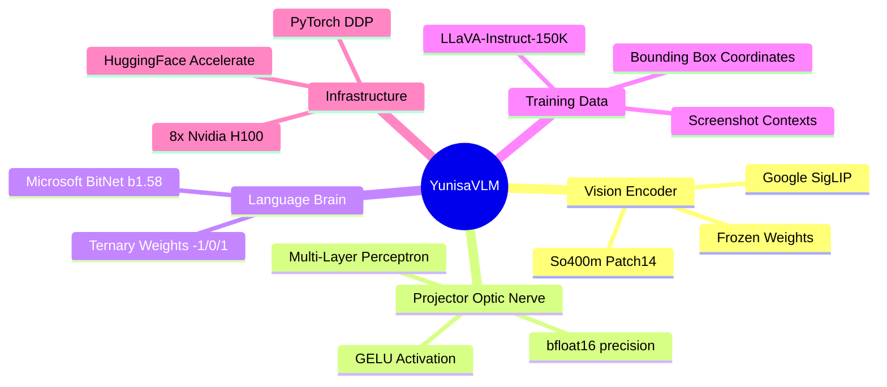
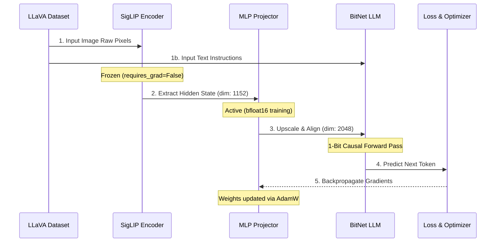
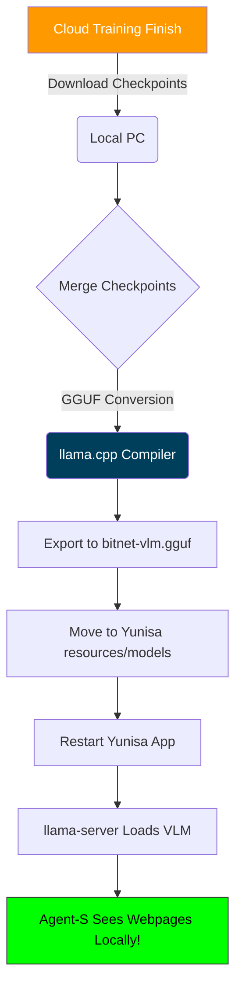

# YunisaVLM Process Maps 

These interactive diagrams map out the macro-architecture, the training sequence, and the deployment pathways for the custom 1-bit Vision-Language model.

## 1. Architectural Mind Map
This map visualizes the core components and datasets intersecting to create the VLM brain.

## 2. End-to-End Training Sequence Diagram
This diagram outlines the flow of data through the PyTorch pipeline over time.

## 3. Deployment Flowchart
Once the projector has been trained in the cloud, this is the path to deploying it back down to your local Yunisa app.

